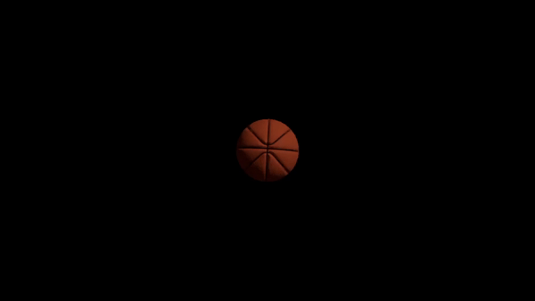

# Introduction
For my research topic I've decided to dive deeper into the technical aspects of 3D graphics by learning how rendering works. Specifically, I'd like to develop an understanding of what a computer needs to do in order to take a standard 3D model file format, like a `.obj` file, and turn it into a rendered image.

At a minimum I'd like to write a renderer that supports both texture and normal maps. The renderer should also be able to rotate, scale and translate the model. Depending on complexity, I would also like to explore different types of lighting (i.e. ambient vs. point lighting).

# Motivation
The motivation for this project tracks back to our first semester when I was working on a 3D model of a door. I sent a screenshot of my door's topology to a friend with significant skill in 3D modelling. Among other things, they suggested that I should make the geometry as square as possible and specifically avoid triangles. This confused me because while I didn't know much about graphics at the time, I did know that GPUs are created specifically with triangles in mind and they can't process quads. After doing some digging I found that while there's consensus that quads are preferable to triangles, most people who claimed to have knowledge on the subject online couldn't explain why. To learn for myself, I wanted to take raw vertex data and turn that into a rendered image to understand exactly why triangles are so universally reviled

# Technology
I haven't fully settled on which technology I'm going to use for this project. I spent some time debating between Java, C# and C++. Each has its benefits and drawbacks and in any case I'd likely end up using a framework like Raylib or Monogame to handle non-rendering tasks like loading files or handling user input.
After consulting with my lecturer though, I've decided to try using [three.js](https://github.com/mrdoob/three.js/). three.js is a Javascript framework for 3D graphics. It has its own rendering code, but I'll obviously be ignoring that and attempting to implement my own. three.js has many of the benefits of the other frameworks/languages I was looking into, plus it has the advantage of being web native. I plan to use three.js but reserve the right to jump to another language or framework in the event that I run into an insurmountable problem.

# Progress
In week 1 progress has involved gaining some basic familiarity with three.js. With it being a relatively new and web-native technology there's a fairly vibrant community with plenty of tutorials. threejs.org provides a set of ["Getting Started tutorials"](https://threejs.org/docs/index.html#manual/en/introduction/Installation) which I followed to get it up and running.
Once it was running I needed to render something. I recently explored how to bake normal maps in Blender by modelling a basketball. three.js natively supports `.gltf` and `.glb` files so I re-exported my basketball from Blender, loaded it into my scene and...
 

There's nothing there. I spent an embarrassing amount of time trying to figure out what was wrong before I tried adding a light to the scene.
 

TA-DA!
